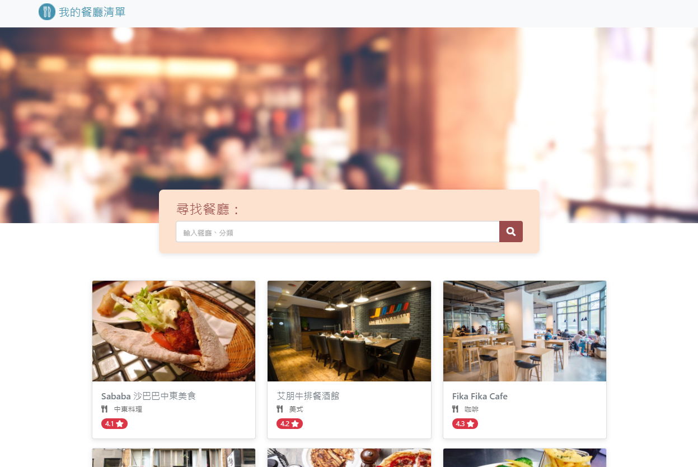

# Restaurant List 

## About
Gather my favorite restaurants so far

## Features

- Check all the restaurants
- Restaurant details
- Search restaurant via name or category


## Prerequisites

1. Node.js (v14.16.0 recommanded)
2. GitBash or Cmder(Windows) / Terminal (Mac)

## Installation
1. Creat a local repository, you can name whatever you want then move to the repo you created via  terminal (Mac) /GitBash (Windows): 
 ```Bash
cd [your local repo path]
 ```
2. Clone the project: 
```Bash
git clone https://github.com/lcy101u/restaurant_list.git
```
3. Install dependencies
```Bash
npm install
```
4. Input: 
```Bash
npm run start
```
5. If you see the message below, that means you run the project successfully
```text
Express is listening on port 3000
```
6. Open browser and type
```
localhost:3000
```
7. Type **Ctrl + c** to stop
### Dev tools

- Node.js (14.16.0)
- Express (4.17.1)
- Express-handlebars (5.3.4)
- Bootstrap (4.6)
- font-awesome (5.8.1)

### Contributor

[Young](https://github.com/lcy101u)
